# MedExplain AI - Architecture Diagram

## System Overview

```mermaid
flowchart TB
    subgraph Client["📱 Client Application"]
        UI[User Interface]
        Upload[Report Upload]
        Chat[Chat Interface]
    end

    subgraph N8N["⚡ n8n Workflow Engine"]
        Webhook[/"🔗 Webhook Trigger<br/>/medexplain-analyze"/]
        
        subgraph Router["🔀 Request Router"]
            IF{Chat or<br/>Analysis?}
        end
        
        subgraph ChatFlow["💬 Chat Flow"]
            ChatAI[Chat AI Call<br/>Groq LLama 3.3]
            FormatChat[Format Chat<br/>Response]
            ChatResponse[Chat Webhook<br/>Response]
        end
        
        subgraph AnalysisFlow["🔬 Analysis Pipeline"]
            Privacy[🔒 Privacy Check<br/>PII Redaction]
            Normalize[📝 Text<br/>Normalization]
            AnalysisAI[Analysis AI Call<br/>Groq LLama 3.3]
            Parse[Parse Analysis<br/>Response]
            RedFlag[🚨 Red-Flag<br/>Detection]
            Safety[🛡️ Medical Safety<br/>Filter]
            Builder[📦 Response<br/>Builder]
            AnalysisResponse[Analysis Webhook<br/>Response]
        end
    end

    subgraph External["☁️ External Services"]
        Groq[("🤖 Groq API<br/>LLama 3.3-70B")]
    end

    subgraph Output["📤 Response Structure"]
        PatientView["👤 Patient View<br/>• Summary<br/>• Possible Meanings<br/>• Questions for Doctor"]
        ClinicianView["👨‍⚕️ Clinician View<br/>• Key Findings<br/>• Critical Values<br/>• Considerations"]
        Citations["📚 Citations<br/>RSNA, NIH, CDC"]
    end

    %% Client to Webhook
    UI --> |HTTP POST| Webhook
    Upload --> UI
    Chat --> UI

    %% Router Logic
    Webhook --> IF
    IF -->|chat_mode=true| ChatAI
    IF -->|chat_mode=false| Privacy

    %% Chat Flow
    ChatAI --> |API Call| Groq
    Groq --> |Response| ChatAI
    ChatAI --> FormatChat
    FormatChat --> ChatResponse

    %% Analysis Flow
    Privacy --> Normalize
    Normalize --> AnalysisAI
    AnalysisAI --> |API Call| Groq
    Groq --> |JSON Response| AnalysisAI
    AnalysisAI --> Parse
    Parse --> RedFlag
    RedFlag --> Safety
    Safety --> Builder
    Builder --> AnalysisResponse

    %% Output
    AnalysisResponse --> PatientView
    AnalysisResponse --> ClinicianView
    AnalysisResponse --> Citations

    style Webhook fill:#4CAF50,color:#fff
    style Groq fill:#6366F1,color:#fff
    style Privacy fill:#FF9800,color:#fff
    style RedFlag fill:#f44336,color:#fff
    style Safety fill:#2196F3,color:#fff
    style PatientView fill:#9C27B0,color:#fff
    style ClinicianView fill:#009688,color:#fff
```



## Data Flow Diagram


## Component Details

### 🔒 Privacy Check (PII Redaction)
| Pattern | Example | Action |
|---------|---------|--------|
| Names | Mr. John Smith | `[NAME REDACTED]` |
| MRN | MRN: 123456 | `[MRN REDACTED]` |
| Dates | 01/15/2024 | `[DATE REDACTED]` |
| Phone | 555-123-4567 | `[PHONE REDACTED]` |
| SSN | 123-45-6789 | `[SSN REDACTED]` |

### 📝 Text Normalization
| Abbreviation | Expansion |
|--------------|-----------|
| w/ | with |
| w/o | without |
| pt | patient |
| hx | history |
| dx | diagnosis |
| tx | treatment |
| sx | symptoms |

### 🚨 Red-Flag Keywords
- **Critical**: malignant, cancer, tumor, critical, urgent
- **Emergency**: stroke, heart attack, myocardial infarction
- **Severe**: life-threatening, acute, sepsis, hemorrhage
- **Vascular**: embolism, aneurysm

### 🛡️ Safety Filter (Prohibited Phrases)
- "you have"
- "you are diagnosed"
- "take this medication"
- "recommended treatment is"
- "you need to"

## API Response Structure

```json
{
  "status": "success",
  "red_flag": false,
  "patient_view": {
    "summary": "Simple explanation (8th-grade level)",
    "possible_meaning": ["What findings may indicate"],
    "questions_for_doctor": ["Suggested questions"]
  },
  "clinician_view": {
    "findings": ["Key clinical findings"],
    "critical_values": ["Abnormal values"],
    "considerations": ["Clinical considerations"]
  },
  "citations": ["RSNA", "NIH", "CDC"],
  "disclaimer": "This is for informational purposes only..."
}
```

## Technology Stack

| Component | Technology |
|-----------|------------|
| Workflow Engine | n8n |
| AI Model | Groq LLama 3.3-70B Versatile |
| API Protocol | REST (HTTP POST) |
| Data Format | JSON |
| Authentication | HTTP Header Auth |

---
*Generated for MedExplain AI - Medical Report Explanation Assistant*
